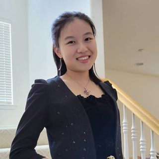

# Angela Tsai's Personal Website



## About Me!

I am a first year student studying **Math and Computer Science** at _UC San Diego_! My home town is Los Angeles. I recently got a pin and I would like to share the quote on it:

> “The only person you should compare yourself to is the person that you were yesterday.”

I really like this quote because it reminds me that I shouldn't be intimidated the fact that I am entering a very competitive field and there are many good CS people out there, rather I should only compare with myself and be proud of my progress along the way!

---

## CS Knowledge

I am still a beginner in the field of CS, but here are some coding languages/tech skills I am familiar with:

- Java
- Python
- C++
- HTML/CSS/JS

I have made some simple projects in the past too, feel free to click on the links and check them out!

1. Java
   - [Tic-Tac-Toe 2.0](https://github.com/angelatsai1214/TicTacToe-2.0)
2. Python
   - [Hangman](https://github.com/angelatsai1214/Hangman.py)
   - [Question Discord Bot](https://github.com/angelatsai1214/Questions-Bot)
3. C++
   - Hotel Management System
   - Pizza Ordering System
4. HTML/CSS/JS
   - [Rock-Papper-Scissor Game](https://github.com/angelatsai1214/Rock-Paper-Scissor-DOM)
   - [Tip Calculator](https://github.com/angelatsai1214/Tip-Calculator-DOM)

---

## Stay Connected

If you'd like to connect with me, the followings are links to my Linkedin and Devpost!

- [Linkedin](https://www.linkedin.com/in/cho-jung-tsai-756150215/)
- [Devpost](https://devpost.com/29317?ref_content=user-portfolio&ref_feature=portfolio&ref_medium=global-nav)

---

## Navigate to my Lab Page for CSE 15L!

1. [Lab Report 1](https://angelatsai1214.github.io/cse15l-lab-reports/lab-report-1-week-0.html)
2. [Lab Report 2](https://angelatsai1214.github.io/cse15l-lab-reports/lab-report-2-week-1.html)
3. [Lab Report 3](https://angelatsai1214.github.io/cse15l-lab-reports/lab-report-3-week-3.html)
4. [Lab Report 4](https://angelatsai1214.github.io/cse15l-lab-reports/lab-report-4-week-5.html)
5. [Lab Report 5](https://angelatsai1214.github.io/cse15l-lab-reports/lab-report-5-week-7.html)
6. [Lab Report 6](https://angelatsai1214.github.io/cse15l-lab-reports/lab-report-6-week-8.html)

---

## Other Markdown Practices

### Paragraphs

Lorem Ipsum is simply dummy text of the printing and typesetting industry. Lorem Ipsum has been the industry's standard dummy text ever since the 1500s, when an unknown printer took a galley of type and scrambled it to make a type specimen book.

It has survived not only five centuries, but also the leap into electronic typesetting, remaining essentially unchanged. It was popularised in the 1960s with the release of Letraset sheets containing Lorem Ipsum passages, and more recently with desktop publishing software like Aldus PageMaker including versions of Lorem Ipsum.

### Code

In-line: `Hello World!`

Code block:

```
String name = "Angela";
System.out.println("Hello " + name);
```

---

## Coding in VS Code

**this** formatting updates as _I type_
